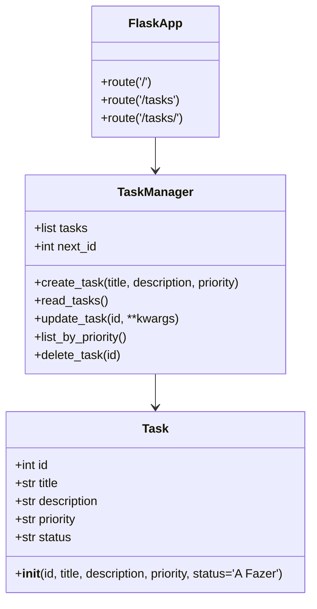

# Parte Teórica

## Descrição do projeto e escopo inicial

O projeto é um sistema web básico de gerenciamento de tarefas que permite criar, listar, atualizar e excluir tarefas. O escopo inicial incluiu:
- CRUD de tarefas (Criar, Ler, Atualizar, Deletar)
- Visualização de lista de tarefas
- Atualização de status das tarefas
- Ordenação e priorização de tarefas
- Registro simplificado de prioridades e status

## Metodologia ágil utilizada

Adotamos Kanban como metodologia principal. O quadro possui as colunas:
- **To Do** / **A Fazer**
- **In Progress** / **Em Progresso**
- **Done** / **Concluído**

A equipe trabalhou com entregas incrementais e foco em pequenas melhorias a cada iteração. As tarefas foram movidas entre as colunas à medida que o desenvolvimento avançou.

## Importância da modelagem na engenharia de software

A modelagem ajuda a transformar requisitos em soluções estruturadas. Diagramas UML facilitam a comunicação entre desenvolvedores, clientes e stakeholders, reduzindo ambiguidades. A modelagem também permite identificar responsabilidades, dependências e possíveis falhas antes da implementação.

## Diagrama de Casos de Uso

```mermaid
usecaseDiagram
    actor Usuario as Usuário
    Usuario --> (Criar Tarefa)
    Usuario --> (Listar Tarefas)
    Usuario --> (Atualizar Status)
    Usuario --> (Excluir Tarefa)
    Usuario --> (Filtrar por Prioridade)
```

## Diagrama de Classes



## Justificativa sobre a mudança de escopo

Durante o projeto houve uma mudança de escopo para transformar a aplicação inicial de terminal em um sistema web. Essa alteração foi motivada pela necessidade de cumprir o requisito de "sistema web básico" e para oferecer uma interface mais acessível para o usuário final.

Além disso, foi incluída a priorização de tarefas, permitindo que tarefas de **Alta** prioridade apareçam antes das demais quando solicitadas.

## Testes automatizados utilizados

O projeto usa:
- **Pytest** para testes unitários
- Testes do modelo `TaskManager`
- Testes de endpoints do app Flask

As rotinas verificam criação, leitura, atualização, exclusão e fluxo básico da interface web.

## Prints comentados do GitHub

> Insira aqui as capturas de tela do GitHub com os seguintes itens:
> - Quadro Kanban com tarefas e cards em **To Do**, **In Progress** e **Done**
> - Histórico de commits relevantes com mensagens semânticas
> - Workflow de CI do GitHub Actions executando os testes

### Exemplo de comentário para prints
- **Kanban**: o quadro mostra pelo menos 10 cards distribuídos nas três colunas e a organização das tarefas por prioridade.
- **Commits**: as mensagens indicam a evolução do projeto, incluindo a mudança de escopo e a implementação da interface web.
- **Workflow de CI**: o GitHub Actions executa `pytest` e `flake8` automaticamente em cada push.
